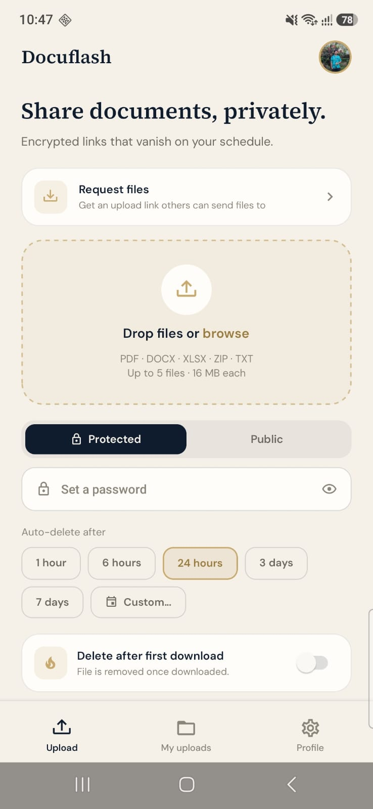
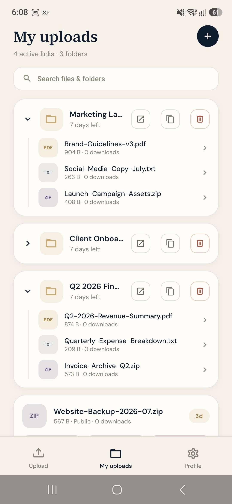
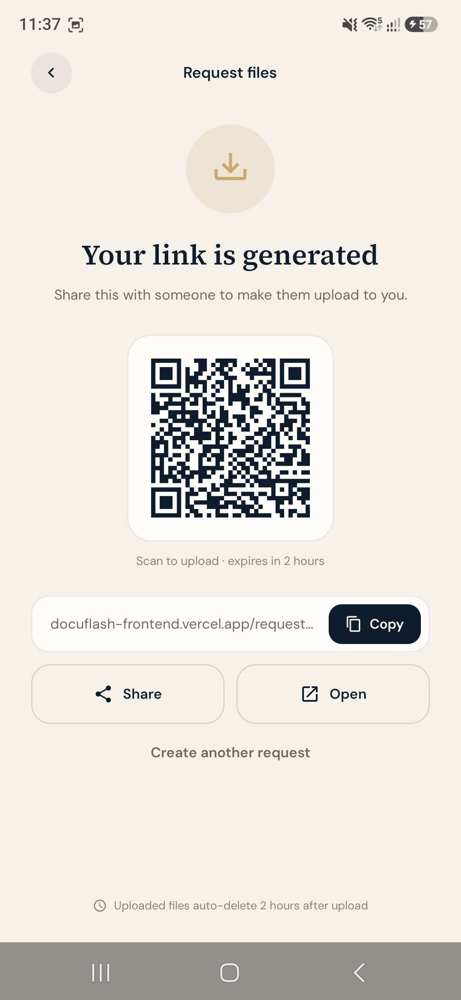
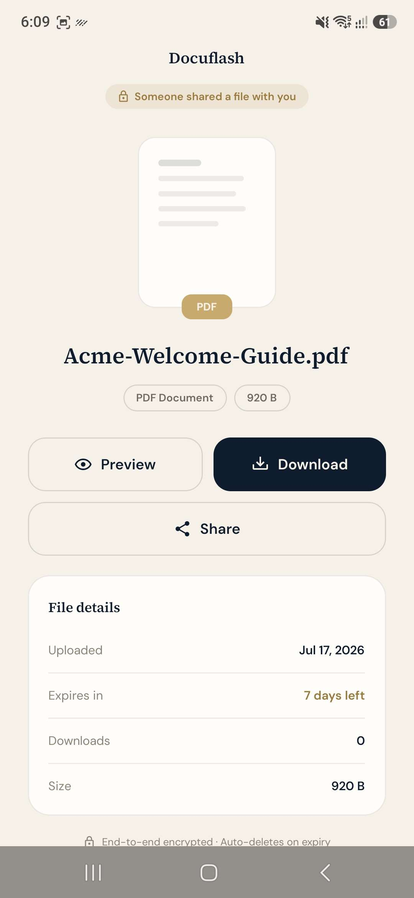
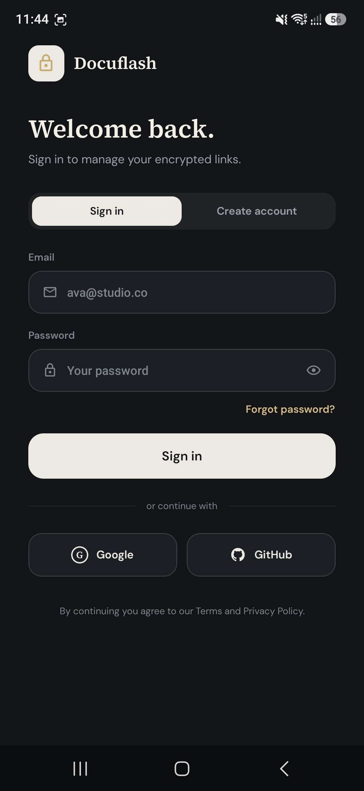
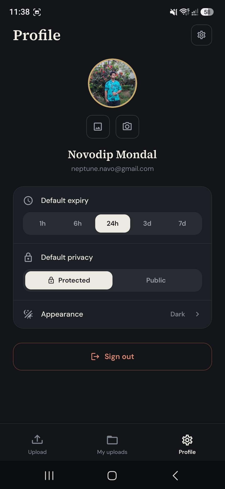
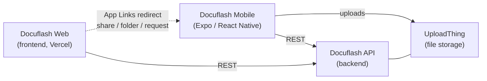

# Docuflash Mobile

Share files privately, from your phone. Docuflash Mobile is the [Expo](https://expo.dev) React Native client for **Docuflash** — a service for creating **encrypted, self-expiring share links** for documents. Upload a file, choose who can open it and for how long, and hand out a link that vanishes on your schedule.

<!-- Optional: add badges, e.g. Play Store link, license, Expo SDK version -->

## Screenshots

| Upload & share | My uploads | Request files (QR) |
| :---: | :---: | :---: |
|  |  |  |

| Shared link viewer | Auth | Profile & theming |
| :---: | :---: | :---: |
|  |  |  |

<!-- Optional: 60–90s demo video — upload to YouTube (unlisted) and link it here.
**[▶ Watch the demo](https://youtu.be/YOUR_VIDEO_ID)**
-->

## Features

- **Upload & share** — pick up to 5 files (PDF, DOCX, XLSX, ZIP, TXT; 16 MB each), optionally group them into a named folder, and generate a share link.
- **Request files** — generate a link (with QR code) that lets *anyone* send files to you, with public or password-protected access.
- **Password protection** — mark any share or request as `Protected` (requires a password to open) or `Public`.
- **Auto-expiry** — links self-delete on schedule, with date/time pickers for custom expiry.
- **My uploads** — browse, search, copy, open, and delete your files and folders, with download counts and expiry badges.
- **Share & folder viewers** — open a `share/…` or `folder/…` link to unlock (if protected), preview, and download.
- **Deep links** — verified Android App Links / iOS Universal Links: `docuflash-frontend.vercel.app/share|folder|request/…` URLs open directly in the app.
- **Authentication** — email/password sign-up & login plus native Google Sign-In, with sessions stored in secure storage.
- **OTA updates** — JS updates ship instantly to installed apps via EAS Update channels (development / preview / production).
- **Theming** — light / dark / system appearance, custom fonts (DM Sans + Source Serif 4), and a token-based design system.

## Architecture

Docuflash is a three-part system; this repo is the mobile client.



| Part | Role |
| --- | --- |
| **docuflash-mobile** (this repo) | Native iOS/Android client — uploads, share management, file requests, deep-link viewers |
| [**Docuflash API**](https://docuflash-api.vercel.app) | REST backend — auth, share tokens, expiry, access control |
| [**Docuflash Web**](https://docuflash-frontend.vercel.app) | Web frontend — share links resolve here and hand off to the app when installed |

## Tech stack

- **Expo SDK 56** + **React Native 0.85** + **React 19** (React Compiler enabled)
- **Expo Router** for file-based, typed navigation
- **TypeScript**
- **react-hook-form** + **Zod** for forms and validation
- **UploadThing** (`@uploadthing/expo`) for file uploads
- **expo-secure-store** for session persistence
- **@react-native-google-signin/google-signin** for native Google auth
- **react-native-qrcode-svg** for shareable QR codes
- **EAS Build + EAS Update** for builds and over-the-air JS updates

> ⚠️ Expo SDK 56 introduced breaking changes. Read the versioned docs at <https://docs.expo.dev/versions/v56.0.0/> before contributing.

## Project structure

```
src/
├── app/                       # Expo Router routes (file-based)
│   ├── _layout.tsx            # Root stack, providers, auth redirect, font loading
│   ├── index.tsx              # Entry redirect
│   ├── auth.tsx               # Sign in / sign up
│   ├── success.tsx            # Post-upload share-link confirmation (modal)
│   ├── share/[shareToken].tsx # Public shared-file viewer (unlock / preview / download)
│   ├── folder/[shareToken].tsx# Shared-folder viewer
│   ├── request/new.tsx        # Create a file request (link + QR, public/protected)
│   ├── request/[shareToken].tsx # Fulfil a file request (upload to someone's folder)
│   └── (tabs)/                # Authenticated tab navigator
│       ├── index.tsx          # Upload screen
│       ├── uploads.tsx        # My uploads (files & folders)
│       └── profile.tsx        # Account, storage, settings, appearance
├── components/                # Icon + reusable UI primitives (Button, Card, Field, …)
├── constants/                 # API base URL, auth, upload limits & MIME types
├── hooks/                     # useUploadSubmit, useColorScheme
├── lib/                       # API client, auth/files/folder endpoints, upload, session, validation
├── state/                     # AuthProvider (auth context)
├── theme/                     # ThemeProvider + design tokens
└── types/                     # Shared TypeScript types (auth, file, folder)
```

## Getting started

### Prerequisites

- Node.js (see `eas.json` — builds use 22.13.0)
- A running Docuflash backend, or use the deployed default API

### 1. Install dependencies

```bash
npm install
```

### 2. Configure environment

Copy `.env.example` to `.env` and fill in the values:

```bash
cp .env.example .env
```

| Variable | Description |
| --- | --- |
| `EXPO_PUBLIC_BASE_URL` | Backend REST + UploadThing host. Defaults to the deployed API. For a local backend on a device/simulator, use your machine's LAN IP (not `localhost`). |
| `EXPO_PUBLIC_SHARE_BASE_URL` | Where share links resolve (the web frontend host). Optional. |
| `EXPO_PUBLIC_GOOGLE_WEB_CLIENT_ID` | Google "Web client" OAuth ID (needed for an idToken). Requires a custom dev build. |
| `EXPO_PUBLIC_GOOGLE_IOS_CLIENT_ID` | Google "iOS client" OAuth ID (iOS only). The reversed form also goes in `app.json`'s `iosUrlScheme`. |

### 3. Start the app

```bash
npm start          # expo start
npm run android    # build & run on Android
npm run ios        # build & run on iOS
npm run web        # run in the browser
```

> Native Google Sign-In requires a [custom development build](https://docs.expo.dev/develop/development-builds/introduction/) — it does not work in Expo Go.

## Scripts

| Script | Description |
| --- | --- |
| `npm start` | Start the Expo dev server |
| `npm run android` / `ios` / `web` | Run on a target platform |
| `npm run lint` | Lint with `expo lint` |
| `npm run build:development:*` | EAS development build (Android / iOS) |
| `npm run build:preview` | EAS preview build (all platforms) |
| `npm run build` | EAS production build (all platforms) |
| `npm run update:production -- "msg"` | Ship an OTA JS update to the production channel |

## Building & releasing

Builds are configured in `eas.json` with `development`, `preview`, and `production` profiles. Development and preview build internal-distribution APKs; production builds an AAB with auto-incremented versions and ships through EAS Submit / the Play Console. JS-only changes go out over the air with EAS Update on the matching channel. See the [EAS Build docs](https://docs.expo.dev/build/introduction/).

## License

See [LICENSE](LICENSE).
