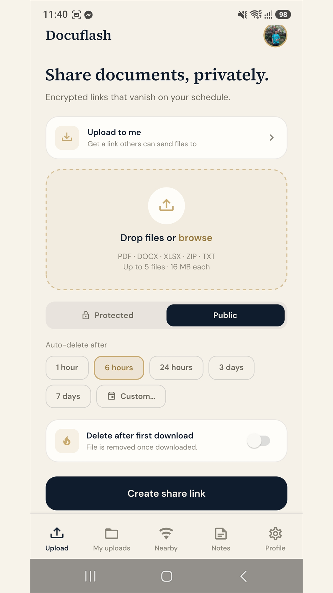
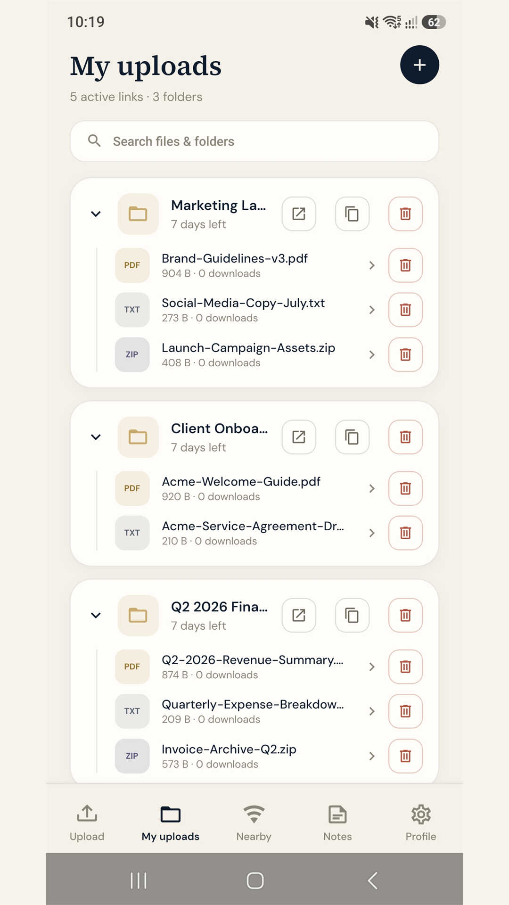
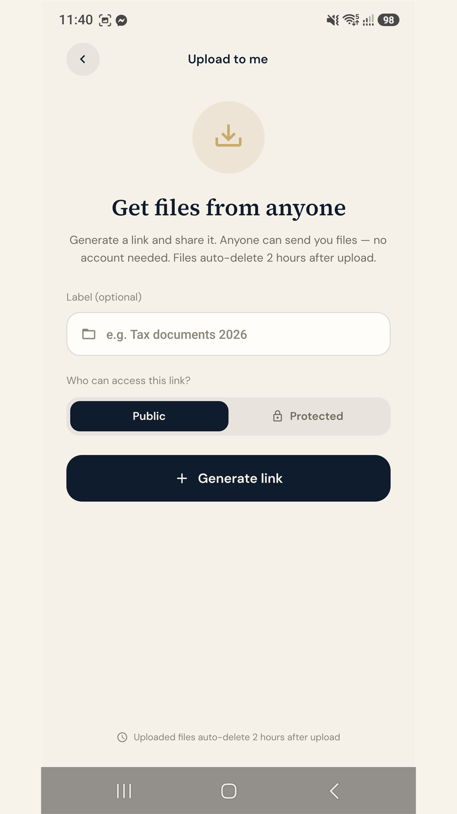
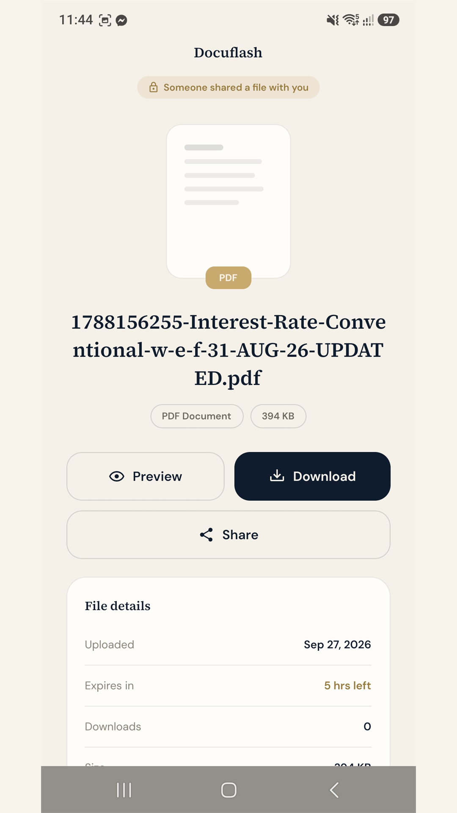
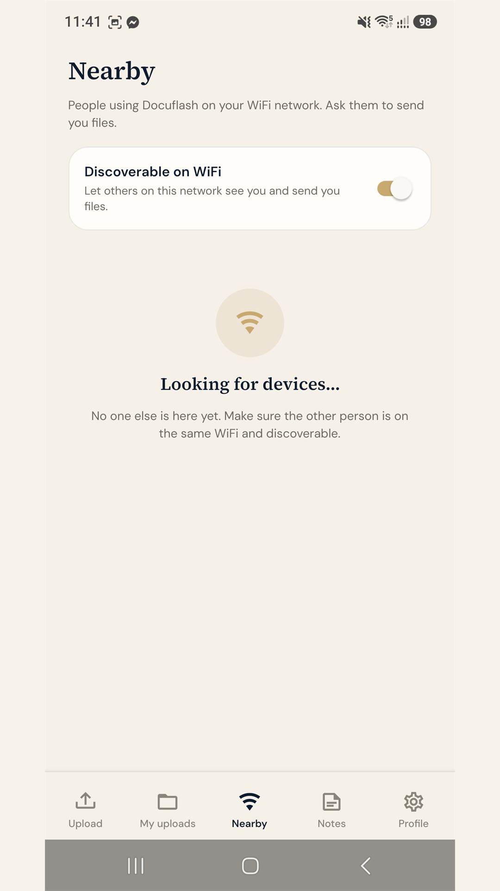
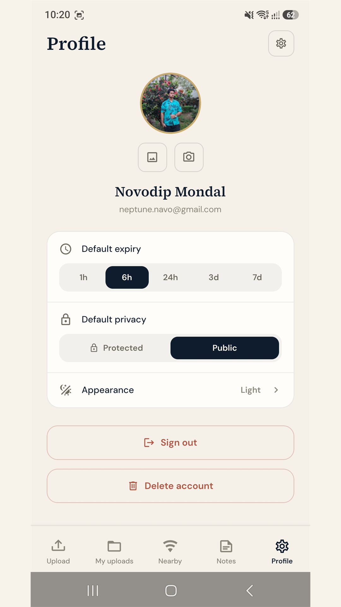
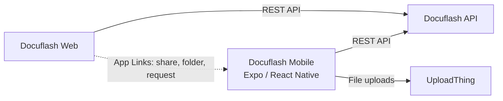

# Docuflash Mobile

**Private, time-limited file sharing from your phone.**

Docuflash Mobile is the Expo and React Native client for [Docuflash](https://docuflash-frontend.vercel.app). Create public or password-protected links for documents and folders, set an expiry, and share them when you need to. You can also create upload-request links so other people can send files to you without creating an account.

## App preview

<p align="center">
  
  
  
</p>

<p align="center">
  
  
  
</p>

## Features

- **Share files and folders** - upload up to five PDF, DOCX, XLSX, ZIP, or TXT files at once and create a link for a single file or a folder.
- **Expiry and download controls** - choose an automatic expiry, use a custom date and time, or delete a file after its first download.
- **Protected links** - require a password before a file, folder, or upload-request link can be opened.
- **Upload to me** - create a link that anyone can use to send you files; no sender account is required.
- **My uploads** - search, open, copy, and remove active file and folder links, with download counts and expiry information.
- **Nearby transfers** - discover Docuflash users on the same Wi-Fi network and request a transfer.
- **Background upload progress** - Android shows a persistent progress notification while a user-initiated upload continues after the app is backgrounded.
- **Safe sharing controls** - shared content can be reported, and request owners can block unwanted upload senders.
- **Personal notes** - keep quick notes that are visible only to the signed-in user.
- **Authentication** - email/password authentication and native Google Sign-In, with sessions stored in secure storage.
- **Deep links** - Docuflash `share`, `folder`, and `request` links open directly in the installed app.

## Architecture


```mermaid
graph LR
    Mobile["Docuflash Mobile\nExpo / React Native"] -->|REST API| API["Docuflash API"]
    Mobile -->|File uploads| UploadThing["UploadThing"]
    Web["Docuflash Web"] -->|REST API| API
    Web -. "App Links: share, folder, request" .-> Mobile
```

| Part | Responsibility |
| --- | --- |
| **docuflash-mobile** (this repository) | Native Android and iOS app, authentication, uploads, link management, deep-link viewers, and local UI. |
| [Docuflash API](https://docuflash-api.vercel.app) | Authentication, file and folder metadata, expiry, access control, notes, and moderation APIs. |
| [Docuflash Web](https://docuflash-frontend.vercel.app) | Signed-out web flows and the browser fallback for sharing links. |
| UploadThing | File storage and upload transport. |

## Tech stack

- Expo SDK 57, React Native 0.86, and React 19
- Expo Router with typed routes
- TypeScript, React Hook Form, and Zod
- Jotai for lightweight client state
- Supabase Realtime for upload-request and nearby-presence events
- UploadThing for upload transport and storage
- `expo-secure-store` for persisted sessions
- Native Google Sign-In and `react-native-notify-kit` for Android upload notifications
- EAS Build and EAS Update for release builds and compatible over-the-air updates

## Project structure

```text
src/
├── app/                         # Expo Router routes
│   ├── auth.tsx                 # Sign in and registration
│   ├── share/[shareToken].tsx   # Shared-file viewer
│   ├── folder/[shareToken].tsx  # Shared-folder viewer
│   ├── request/                 # Create and fulfil upload requests
│   └── (tabs)/                  # Uploads, nearby, notes, and profile tabs
├── components/                  # Reusable UI and feature components
├── hooks/                       # Upload, realtime, and device hooks
├── lib/                         # API clients, auth, uploads, notifications, and utilities
├── state/                       # Jotai atoms and providers
├── theme/                       # Fonts, colour tokens, and appearance provider
└── types/                       # Shared TypeScript models
assets/play-store/phone/         # Play Store-ready phone screenshots
```

## Getting started

### Prerequisites

- Node.js **22.13.0** (the version used by EAS builds)
- Android Studio for local Android builds, or Xcode for local iOS builds
- A running Docuflash backend, or the deployed API

### Install and configure

```powershell
nvm use 22.13.0
npm ci
Copy-Item .env.example .env
```

Set the following values in `.env`:

| Variable | Purpose |
| --- | --- |
| `EXPO_PUBLIC_BASE_URL` | Docuflash API and UploadThing host. Use your computer's LAN IP rather than `localhost` when testing on a physical device. |
| `EXPO_PUBLIC_SHARE_BASE_URL` | Web host used to resolve share links. |
| `EXPO_PUBLIC_SUPABASE_URL` | Supabase project URL for realtime request and nearby events. |
| `EXPO_PUBLIC_SUPABASE_ANON_KEY` | Supabase anonymous key. |
| `EXPO_PUBLIC_GOOGLE_WEB_CLIENT_ID` | Google OAuth web-client ID required to obtain a native Google ID token. |
| `EXPO_PUBLIC_GOOGLE_IOS_CLIENT_ID` | Google OAuth iOS-client ID, when building for iOS. |

### Run locally

```bash
npm start
npm run android
npm run ios
npm run web
```

> Native Google Sign-In and background upload notifications require a custom development build. They do not work in Expo Go.

## Scripts

| Command | Description |
| --- | --- |
| `npm run lint` | Run Expo linting. |
| `npm run android` / `npm run ios` / `npm run web` | Build and run a local target. |
| `npm run prebuild:clean:android` | Regenerate the Android project from Expo config. |
| `npm run build:development:android` | Create an internal Android development build. |
| `npm run build:preview:android` | Create an internal Android preview APK. |
| `npm run build:android` | Create a production Android App Bundle for Google Play. |
| `npm run update:preview -- "message"` | Publish a compatible JS update to the preview channel. |
| `npm run update:production -- "message"` | Publish a compatible JS update to the production channel. |

## Releases and OTA updates

EAS profiles are defined in `eas.json`:

- **development** - internal development build.
- **preview** - internal-distribution APK on the `preview` update channel.
- **production** - Play Store-ready AAB on the `production` update channel.

This project uses Expo's `fingerprint` runtime policy. Publish an OTA update only when the change is JavaScript or asset-only and compatible with the installed native runtime. Any native dependency, Expo config, Android permission, or plugin change requires a new native build and Play Console upload.

Before making an EAS build locally, use Node 22.13.0 and run `npm ci`. The included `.fingerprintignore` excludes disposable native build outputs inside `node_modules`, helping local fingerprints match EAS's clean install.

## Contributing

Run `npm run lint` before opening a change. For changes that affect native configuration or dependencies, also create and test a fresh development or preview build.

## License

See [LICENSE](LICENSE).
